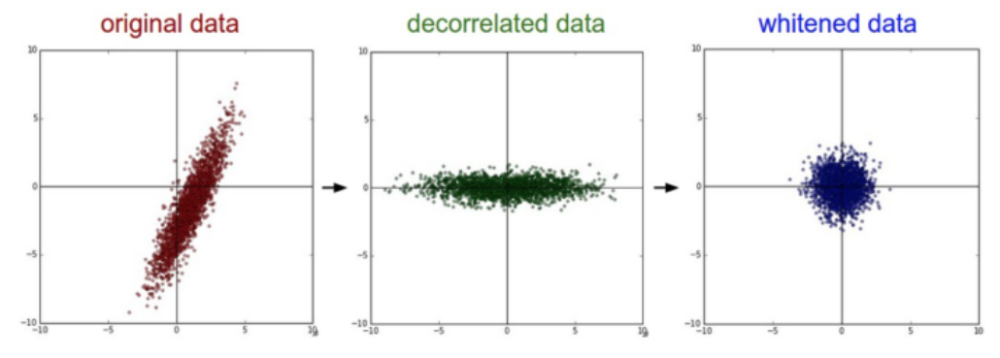
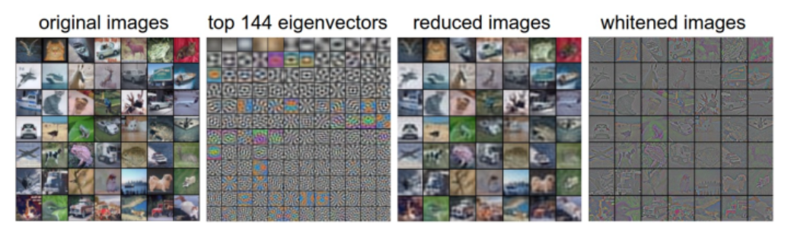

# Chapter3 

* 设置数据和模型
  * 数据预处理
  * 权重初始化
  * 批量归一化(Batch Normalization)
  * 正则化(L2/L1/Maxnorm?Dropout)
  * 损失函数
  * 小结

* **设置数据和模型**
神经网络就是进行了一系列的线性映射与非线性激活函数交织的运算。

* 数据预处理
    数据预处理，数据矩阵X，其尺寸为 [N x D]

    * 均值减法(Mean subtraction)是预处理最常用的形式。它对数据中每个独立特征减去平均值，从几何上可以理解为在每个维度上都将数据云的中心迁移到原点。在numpy中，该操作通过代码 **X -= np.mean(X,asix=0)** 实现，而对于图像，更常用的是对所有象素都减去一个值。
    * 归一化是指将数据的所有维度都归一化，使其数值范围都近似相等。第一种是先对数据做零中心化处理，然后每个维度都除以其标准差，实现代码 X /= np.std(X,axis=0).第二种是对每个维度都做归一化，使得每个维度的最大和最小值是1和-1.
  
  **左边**：原始的2维输入数据
  **中间**：在每个维度都减去平均值后得到零中心化数据，现在数据云是以原点为中心的。
  **右边**：每个维度都除以其标准差来调整其数值范围，红色的线指出了数据各维度的数值范围，在中间的零中心化数据的数值范围不同，但在右边归一化数据中数值范围相同。

  * **PCA和白化** 是另一种预处理形式。在这种处理中，先对数据进行零中心化处理，然后计算协方差矩阵，它展示了数据中相关性结构。
  ```python
  #假设输入数据矩阵X的尺寸为 [N x D]
  X -= np.mean(X,axis=0) #对数据进行零中心化
  conv = np.dot(X.T,X) / X.shape[0] # 得到数据的协方差矩阵
  ```
  协方差公式：
  $$
    \operatorname{Cov}(X, Y)=E[(X-E[X])(Y-E[Y])]
  $$
  $$
  \operatorname{Cov}(X, Y)=E[X Y]-E[X] E[Y]
  $$
  数据协方差矩阵的第(i,j)个元素是数据第i个和第j个维度的协方差。具体来说，该矩阵的对角线的元素是方差，协方差矩阵是对称和半正定的。我们可以对数据协方差矩阵进行SVD（奇异值分解）运算。
  ```python
  U,S,V = np.linalg.svd(cov)
  ```
  U的列是特征向量，S是装有奇异值的1维数组(因为cov是对称且半正定的，所以S中元素是特征值的平方)。为了去除数据相关性，将已经零中心化处理过的原始数据投影到特征基准上：
  ```python
  xrot = np.dot(X,U) #对数据去相关性
  ```
U的列是标准正交向量的集合，可以看作标准正交基向量，因此，投影对应x中的一个数据的旋转，旋转产生的结果就是新的特征向量。如果计算 **Xrot**的协方差矩阵，将会看到它是对角对称的。**np.linalg.svd** 的一个良好的性质就是在它返回值U中，特征向量是俺早特征值的大小排列的，我们可以利用这个性质来对 **数据降维**，只要使用前面的小部分特征向量，丢弃那些包含的数据没有 **方差**的维度，
```python
Xrot_reduced = np.dot(X,U[:,:100]) #Xrot_deduced 变成 [N*100]
```
经过上面的操作，将原始的数据集的大小由 [NxD]降到了 [Nx100]，留下了数据中包含最大方差的100个维度。通常使用 PCA降维过的数据训练线性分类器和 神经网络会达到非常好的性能效果，同时节省时间和存储器空间

**白化(whitening)**:
白化操作的输入是特征基准上的数据，然后对每个维度除以其特征值来对数值范围进行归一化。该变化的几何解释是：如果数据服从多变量的高斯分布，那么经过白化后，数据的分布将会是一个均值为0，且协方差相等的矩阵。
```python
#对数据进行白化操作
#除以特征值
Xwhite = Xrot/ np.sqrt(S+1e-5)
```
警告：夸大的噪声，注意分母中添加了 1e-5来防止分母为0，该变换的一个缺陷是在变化过程中可能会夸大数据中的噪声，这是因为它将所有维度都拉伸到相同的数值范围，这些维度中也包含了那些只有极少差异性(方差小)而大多是噪声的维度，在实际操作中，这个问题可以用更强的平滑来解决(例如：采用比 1e-5 更大的值)



PCA/白化，**左边** 是二维的原始数据，**中间**:经过PCA操作的数据，可以看出数据是零中心的，然后变换到了数据协方差矩阵的基准轴上，这样就对数据进行了 **解相关**(协方差矩阵变成了对角阵)。**右边**：每个维度都被特征值调整了数值范围，将数据协方差变为了单位矩阵。从几何上看，就是对数据在各个方向上拉伸压缩，使之变成服从高斯分布的一个数据点分布。

---
我们可以用  **CIFAR-10** 数据将这些变化可视化出来，CIFAR-10训练集的大小是 5000083072.每张图片可以拉伸为 3072维向量，可以计算 [3072x3072]的协方差矩阵，然后进行奇异值分解，那么经过计算的特征向量如图：



**最左**：一个用于演示的集合，含49张图片。**左二**：3072个特征值向量中的前144个。靠前面的特征向量解释了数据中大部分的方差，可以看见它们与图像中较低的频率相关。**第三张**：是49张经过了PCA降维处理的图片，展示了144个特征向量。这就是说，展示原始图像是每个图像用3072维的向量，向量中的元素是图片上某个位置的像素在某个颜色通道中的亮度值。而现在每张图片只使用了一个144维的向量，其中每个元素表示了特征向量对于组成这张图片的贡献度。为了让图片能够正常显示，需要将144维度重新变成基于像素基准的3072个数值。因为U是一个旋转，可以通过乘以U.transpose()[:144,:]来实现，然后将得到的3072个数值可视化。可以看见图像变得有点模糊了，这正好说明前面的特征向量获取了较低的频率。然而，大多数信息还是保留了下来。**最右**：将“白化”后的数据进行显示。其中144个维度中的方差都被压缩到了相同的数值范围。然后144个白化后的数值通过乘以U.transpose()[:144,:]转换到图像像素基准上。现在较低的频率（代表了大多数方差）可以忽略不计了，较高的频率（代表相对少的方差）就被夸大了。


