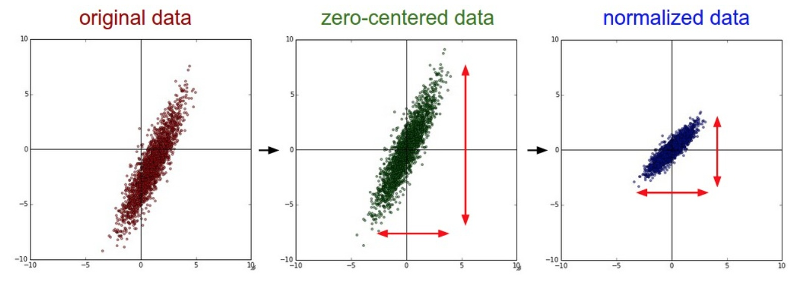

# Chapter3 

* 设置数据和模型
  * 数据预处理
  * 权重初始化
  * 批量归一化(Batch Normalization)
  * 正则化(L2/L1/Maxnorm?Dropout)
  * 损失函数
  * 小结

* **设置数据和模型**
神经网络就是进行了一系列的线性映射与非线性激活函数交织的运算。

* 数据预处理
    数据预处理，数据矩阵X，其尺寸为 [N x D]

    * 均值减法(Mean subtraction)是预处理最常用的形式。它对数据中每个独立特征减去平均值，从几何上可以理解为在每个维度上都将数据云的中心迁移到原点。在numpy中，该操作通过代码 **X -= np.mean(X,asix=0)** 实现，而对于图像，更常用的是对所有象素都减去一个值。
    * 归一化是指将数据的所有维度都归一化，使其数值范围都近似相等。第一种是先对数据做零中心化处理，然后每个维度都除以其标准差，实现代码 X /= np.std(X,axis=0).第二种是对每个维度都做归一化，使得每个维度的最大和最小值是1和-1.
  
  **左边**：原始的2维输入数据
  **中间**：在每个维度都减去平均值后得到零中心化数据，现在数据云是以原点为中心的。
  **右边**：每个维度都除以其标准差来调整其数值范围，红色的线指出了数据各维度的数值范围，在中间的零中心化数据的数值范围不同，但在右边归一化数据中数值范围相同。

  * **PCA和白化** 是另一种预处理形式。在这种处理中，先对数据进行零中心化处理，然后计算协方差矩阵，它展示了数据中相关性结构。
  ```python
  #假设输入数据矩阵X的尺寸为 [N x D]
  X -= np.mean(X,axis=0) #对数据进行零中心化
  conv = np.dot(X.T,X) / X.shape[0] # 得到数据的协方差矩阵
  ```
  协方差公式：
  $$
    \operatorname{Cov}(X, Y)=E[(X-E[X])(Y-E[Y])]
  $$
  $$
  \operatorname{Cov}(X, Y)=E[X Y]-E[X] E[Y]
  $$
  数据协方差矩阵的第(i,j)个元素是数据第i个和第j个维度的协方差。具体来说，该矩阵的对角线的元素是方差，协方差矩阵是对称和半正定的。我们可以对数据协方差矩阵进行SVD（奇异值分解）运算。
  ```python
  U,S,V = np.linalg.svd(cov)
  ```
  U的列是特征向量，S是装有奇异值的1维数组(因为cov是对称且半正定的，所以S中元素是特征值的平方)。为了去除数据相关性，将已经零中心化处理过的原始数据投影到特征基准上：
  ```python
  xrot = np.dot(X,U) #对数据去相关性
  ```

