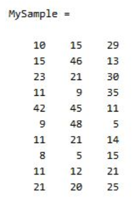
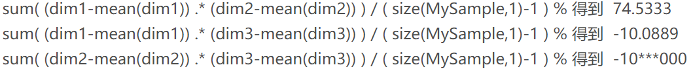
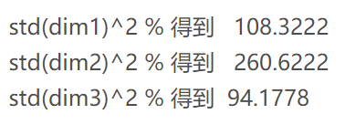
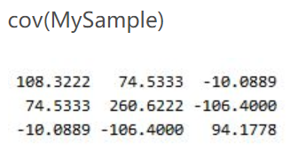

# PCA 主成分分析详解
PCA(Principal Components Analysis)即主成分分析，是图像处理中经常用到的降维方法，比如在经常用的 **图像查询**问题，在一个几万或者几百万的数据库中查询一幅相近的图像，我们通常的方法是对 图像库中的图片提取响应的特征，如 颜色，纹理，sift，surf等特征保存，建立响应的数据索引，然后对要查询的图像提取相应的特征，与数据库中的图像特征对比，找出与之相近的图片。

这里，如果我们为了提高查询的准确率，通常会提取一些较为复杂的特征，如sift,surf等，一幅图像有很多个这种特征点，每个特征点又有一个相应的描述该特征的128维的向量，设想如果一幅图像有300个这种特征点，那么幅图像就有 300*vector(128维)个，如果我们数据库有一百万张土拍你，这个存储量是相当大的，建立索引也很耗时，如果我们对每个向量进行 PCA处理，将其降维维 64维。

## PCA详解
1. 原始数据
x=[2.5, 0.5, 2.2, 1.9, 3.1, 2.3, 2, 1, 1.5, 1.1]T

y=[2.4, 0.7, 2.9, 2.2, 3.0, 2.7, 1.6, 1.1, 1.6, 0.9]T

2. 计算协方差矩阵
有一个含有n个样本的集合，依次给出数理统计中的一些相关概念：

均值:
 $$
\overline{X}=\frac{\sum_{i=1}^{n} X_{i}}{n}
$$

标准差：
$$
s=\sqrt{\frac{\sum_{i=1}^{n}\left(X_{i}-\overline{X}\right)^{2}}{n-1}}
$$

方差：
$$
s^{2}=\frac{\sum_{i=1}^{n}\left(X_{i}-\overline{X}\right)^{2}}{n-1}
$$
协方差： 
$$
\operatorname{cov}(X, Y)=\frac{\sum_{i=1}^{n}\left(X_{i}-\overline{X}\right)\left(Y_{i}-\overline{Y}\right)}{n-1}
$$
协方差矩阵：
$$
C_{n \times n}=\left(c_{i, j}, c_{i, j}=\operatorname{cov}\left(\operatorname{Dim}_{i}, D i m_{j}\right)\right)
$$
比如一个简单的三维矩阵，假设数据集有$\{x,y,z\}$三个维度，协方差矩阵：
$$
C=\left(\begin{array}{ccc}{\operatorname{cov}(x, x)} & {\operatorname{cov}(x, y)} & {\operatorname{cov}(x, z)} \\ {\operatorname{cov}(y, x)} & {\operatorname{cov}(y, y)} & {\operatorname{cov}(y, z)} \\ {\operatorname{cov}(z, x)} & {\operatorname{cov}(z, y)} & {\operatorname{cov}(z, z)}\end{array}\right)
$$
**协方差就是一个对称的矩阵，而且对角线是各个维度上的方差**。

3. 协方差矩阵的求法。

计算协方差需要计算均值，协方差矩阵是 **计算不同维度间的协方差**。样本矩阵的每行是一个样本，每列是一个维度，所以我们要按 列计算均值。先将三个维度的数据分别赋值：
$$
\begin{array}{l}{\operatorname{dim} 1=\text { MySample }( :， 1)} \\ {\operatorname{dim} 2=\text { MySample }( :， 2)} \\ {\operatorname{dim} 3=\text { MySample }( :， 3)}\end{array}
$$
计算dim1与dim2,dim2与dim3的协方差：

协方差矩阵的对角线就是各个维度上的方差，下面我们依次计算：

这样结果为：

下面简化的方法进行计算：
首先让样本矩阵 **中心化**，即每一维度减去该维度的均值，然后直接用新得到的样本矩阵 **乘上它的转置**，然后除以N-1即可。

1. 计算协方差矩阵的特征向量和特征值
因为协方差矩阵为方阵，我们可以计算它的特征向量和特征值。

$$
eigenvalues=\left(\begin{array}{c}{.0490833989} \\ {1.28402771}\end{array}\right)
$$
$$
eigenvectors=\left(\begin{array}{cc}{-.735178656} & {.677873399} \\ {.677873399} & {.735178656}\end{array}\right)
$$

4. 选择成分组成模式矢量
   求出协方差矩阵的特征值及特征向量之后，按照特征值由大到小进行排列，可以忽略那些重要性很小的成分，当然这会丢失一些信息，但是如果对应的特征值很小，不会丢失很多信息，
$$
\left(\begin{array}{cc}{.677873399} & {-.735178656} \\ {.735178656} & {.677873399}\end{array}\right)
$$
我们可以忽略其中较小特征值的一个特征矢量，得到如下模式矢量：
$$
\left(\begin{array}{c}{.677873399} \\ {.735178656}\end{array}\right)
$$

5. 得到降维后的数据
   