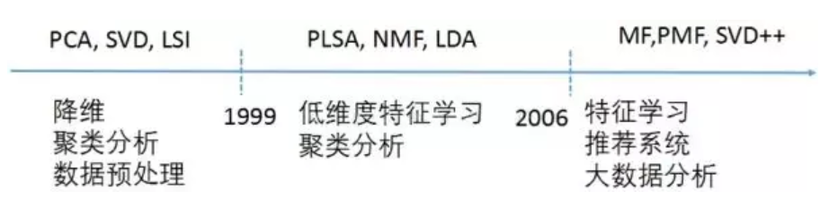
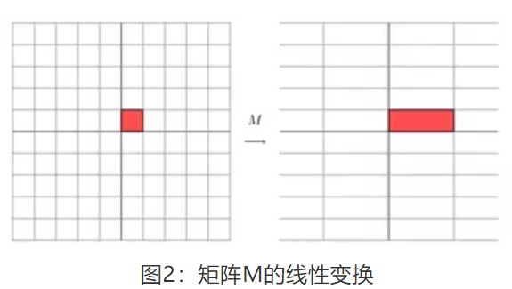
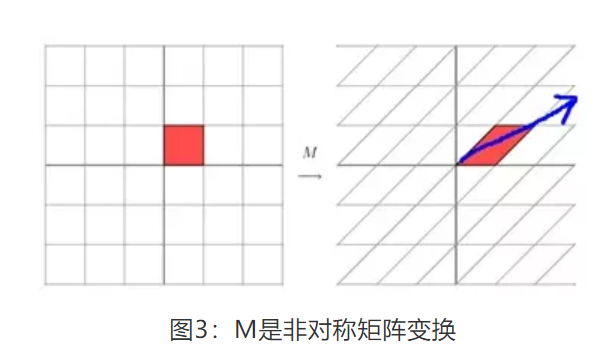
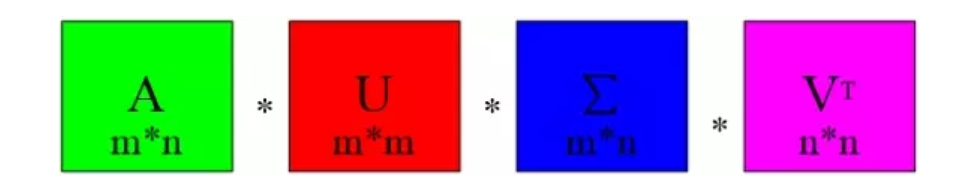

# 1. 矩阵分解
## 1.1 矩阵分解作用
* 矩阵填充(通过矩阵分解来填充原有矩阵，例如协同过滤的ALS算法就是填充原有矩阵)
* 清理异常值与离群点
* 降维，压缩
* 个性化推荐
* 间接的特征组合(计算特征间相似度)

## 1.2 矩阵分解的方法
* 特征值分解
* PCA(principal Component Analysis)分解，作用：降维、压缩
* LSI(Latent Semantic Indexing),隐语义分析分解
* PLSA(Probabilistic Latent Semantic Analysis),概率潜在语义分析
* NMF(Non-negative Matrix Factorzation),非负矩阵分解能够广泛的应用于图像分析，文本挖掘和语言处理等领域
* LDA(Latent Dirichlet Allocation)模型，潜在狄利克雷分配模型，LDA是一种主题模型，将文档集中每篇文档的主题以概率的形式给出，可以用于主题聚类或者文本分类，即是 **生成式模型**，LDA作为主题模型可以应用到很多邻域，比如：文本情感分析，文本分类，个性化推荐，社交网络，广告预测等
* MF(Matrix Factorization)模型，矩阵分解模型，矩阵分解其实可以分为很多种：
    * 基本矩阵分解
    * 正则化矩阵分解
    * 概率矩阵分解
    * 非负矩阵分解
    * 正交非负矩阵分解
    * SVD
  
下图是矩阵分解发展的历史：

# 2. SVD具体介绍
## 2.1 特征值、特征向量、特征值分解
**特征值分解** 和 **奇异值分解** 在机器学习都是很常见的矩阵分解算法。两者有很紧密的关系，特征值分解和奇异值分解的目的都是一样的，就是提取出矩阵 **一个最重要的特征**。

1. 特征值、特征向量
   
   如果一个向量v是矩阵A的特征向量，将一定可以表示成下面的形式：
$$
A v=\lambda v
$$
其中，$\lambda$是特征向量v对应的特征值，一个矩阵的 **一组特征向量** 是一组 正交向量。
**思考**：为什么一个向量和一个数相乘的效果 与一个矩阵和一个向量相乘的效果是一样的呢？
答案：矩阵A与向量v相乘，本质上是对向量v进行了一次线性变换(旋转或者拉伸)，而该变换的效果为常数$\lambda$乘以向量v。当我们求特征值与特征向量的时候，就是为了求矩阵A能使那些向量(特征向量)只发生 伸缩变换，而变换的程度可以用特征值$\lambda$表示

2. 特征值和特征向量的几何意义
   一个矩阵其实就是一个线性变换，因为一个矩阵乘以一个向量后得到的向量，其实就相当于将这个向量进行了线性变换。比如；
$$
M=\left[\begin{array}{ll}{3} & {0} \\ {0} & {1}\end{array}\right]
$$
它其实对应的线性变换是下图的形式：

因为这个矩阵M乘以一个向量(x,y)的结果是：
$$
\left[\begin{array}{ll}{3} & {0} \\ {0} & {1}\end{array}\right]\left[\begin{array}{l}{x} \\ {y}\end{array}\right]=\left[\begin{array}{c}{3 x} \\ {y}\end{array}\right]
$$
上面的矩阵是对称的，所以这个变换是一个对x，y轴的方向一个拉伸变换(每一个对角线上的元素将会对一个维度进行拉伸变换，当值大于1时时拉伸，当值小于1时是缩短)，当矩阵不是对称的时候：
$$
M=\left[\begin{array}{ll}{1} & {1} \\ {0} & {1}\end{array}\right]
$$
变换如下：

2. 特征值分解
   对于矩阵A,有一组特征向量v，将这组向量进行正交化单位化，就能得到一组正交单位向量，**特征值分解**，就是将矩阵A分解如下式：
$$
A=Q \Sigma Q^{-1}
$$
其中,Q是矩阵A的特征向量组成的矩阵，$\Sigma$则是一个对角矩阵，对角阵上的元素就是特征值。
总结:特征值分解可以得到 **特征值** 和 **特征向量**，特征值表示的是这个特征到底有多么重要，而特征向量表示这个特征是什么。可以将每一个特征向量理解为一个线性的子空间，我们可以用这些线性的子空间干很多事，不过 **特征值分解也有很多局限**，**比如变换的矩阵必须是方阵**。

3. 特征值分解的例子
   方阵A为：
$$
A=\left(\begin{array}{ccc}{-1} & {1} & {0} \\ {-4} & {3} & {0} \\ {1} & {0} & {2}\end{array}\right)
$$

由方阵A的特征方程，求出特征值：
$$
|A-\lambda E|=\left|\begin{array}{ccc}{-1-\lambda} & {1} & {0} \\ {-4} & {3-\lambda 0} & {} \\ {1} & {0} & {2-\lambda}\end{array}\right| = (2-\lambda)\left|\begin{array}{cc}{-1-\lambda} & {1} \\ {-4} & {3-\lambda}\end{array}\right|
\\
= (2-\lambda)(\lambda-1)^{2}=0
$$
特征值为 $\lambda=2,1,1$
然后把每个特征值$\lambda$带入线性方程组 $(A-\lambda E) x=0$.求出特征向量。

当$\lambda=2$时，解线性方程组 $(A-2 E) x=0$
$$(A-2 E)=\left(\begin{array}{ccc}{-3} & {1} & {0} \\ {-4} & {1} & {0} \\ {1} & {0} & {0}\end{array}\right) \rightarrow\left(\begin{array}{ccc}{1} & {0} & {0} \\ {0} & {1} & {0} \\ {0} & {0} & {0}\end{array}\right)$$ 
解得$x_1=0,x_2=0$,特征向量为 
$$
p_{1}=\left(\begin{array}{l}{0} \\ {0} \\ {1}\end{array}\right)
$$
当$\lambda=1$时，解线性方程组 $(A-2 E) x=0$
$$
(A-E)=\left(\begin{array}{ccc}{-2} & {1} & {0} \\ {-4} & {2} & {0} \\ {1} & {0} & {1}\end{array}\right) \rightarrow\left(\begin{array}{ccc}{1} & {0} & {1} \\ {0} & {1} & {2} \\ {0} & {0} & {0}\end{array}\right)
$$
$x_{1}+x_{3}=0, \quad x_{2}+2 x_{3}=0$.特征向量为：
$$
p_{2}=\left(\begin{array}{c}{-1} \\ {-2} \\ {1}\end{array}\right)
$$

最后，方阵A的特征值分解为：
$$
A=Q \Sigma Q^{-1}=\left(\begin{array}{ccc}{0} & {-1} & {-1} \\ {0} & {-2} & {-2} \\ {1} & {1} & {1}\end{array}\right)\left(\begin{array}{ccc}{2} & {0} & {0} \\ {0} & {1} & {0} \\ {0} & {0} & {1}\end{array}\right)\left(\begin{array}{ccc}{0} & {-1} & {-1} \\ {0} & {-2} & {-2} \\ {1} & {1} & {1}\end{array}\right)^{-1}
$$

## 2.2 SVD分解
1. 特征值分解矩阵的缺点
   只针对于方阵。特征值分不能用于m*n矩阵

2. 奇异值分解
   奇异值分解时一个能适用于 **任意矩阵的**一种分解的方法，对于任意矩阵A总是存在一个奇异值分解：
$$
A=U \Sigma V^{T}
$$ 
假设矩阵A是一个 m\*n的矩阵，那么得到的U是一个 m\*m 的方阵，U里面的正交向量被称为 左奇异向量，$\Sigma$是一个 m\*n的矩阵，$\Sigma$除了对角线其它的元素都为0，对角线上的元素称为 **奇异值**，$V^T$是V的转置矩阵，是一个 n\*n的矩阵，它里面的正交向量被称为 **右奇异值向量**。而且一般来讲，我们会将 $\Sigma$上的值按从大到小的顺序排列，上面的矩阵维度变化可以参照下图。

**思考**：虽然说上面的 **奇异值分解等式** 成立，但是如何求得左奇异向量，右奇异向量，和 奇异值？
答案：由上面的奇异值分解等式，我们是不知道如何拆分矩阵A,我们可以把 **奇异值** 和 **特征值** 联系起立。

首先，我们用矩阵A的转置乘以A，得到一个方阵，用这样的方阵进行 **特征分解**，得到的 特征值和特征向量满足下面的等式：
$$
\left(A^{T} A\right) v_{i}=\lambda_{i} v_{i}
$$

这里的 $v_i$就是 **右奇异向量**。
$$
\left(A A^{T}\right) u_{i}=\lambda_{i} u_{i}
$$
这里的$u_i$就是 **左奇异值向量**
证明如下：
$$
A=U \Sigma V^{T} \Rightarrow A^{T}=V \Sigma^{T} U^{T} \Rightarrow A^{T} A=V \Sigma^{T} U^{T} U \Sigma V^{T}=V \Sigma^{2} V^{T}(*)
$$
其中使用了$U^{T} U=I$ ，$\Sigma^{T} \Sigma=\Sigma^{2}$.可以看出，$A^TA$的特征向量组成的矩阵就是我们 SVD中的v矩阵。
**奇异值** 的求法：
$$
A=U \Sigma V^{T} \Rightarrow A V=U \Sigma V^{T} V \Rightarrow A V=U \Sigma \Rightarrow A v_{i}=\sigma_{i} u_{i} \Rightarrow \sigma_{i}=\frac{A v_{i}}{u_{i}}
$$
此外，我们还可以看出，特征值矩阵等于 奇异值矩阵的平方，也就是说特征值和奇异值满足如下关系：
$$
\sigma_{i}=\sqrt{\lambda_{i}}
$$
这里的$\sigma_{i}$就是奇异值，奇异值 $\sigma_{i}$和特征值类似，在矩阵 $\Sigma$也是从大到小排列

**思考**：我们已经知道如何用奇异值分解任何矩阵了，那么，一个 m\*n的矩阵A,分解为 m\*m的矩阵U，m\*n的矩阵$\Sigma$，和 n\*n矩阵 $V^T$.这三个矩阵的任何一个维度都比A大，复杂度为$O(n^3)$.
答案：在奇异值分解矩阵中，$\Sigma$里面的奇异值按从大到小的顺序排列，奇异值 $\sigma_i$从大到小的顺序减小的特别快，**在很多情况下，签10%甚至1%的奇异值的和就占了全部奇异值之和的 99%以上，也就是说，剩下的 90%甚至99%的奇异值几乎没有什么作用，**
$$A_{m * n} \approx U_{m * r} \Sigma_{r * r} V_{r * n}^{T}$$
其中r是一个远远小于m和n的数，右边的三个矩阵相乘的结果将会使一个接近A的矩阵。如果r越接近于n，则相乘的结果越接近于A。如果r的取值远远小于n，从计算机内存的角度来说，右边三个矩阵的存储内存要远远小于矩阵A的。**所以在奇异值分解中r的取值很重要，就是在计算精度和时间空间之间做选择。**

3. SVD计算举例
   这里A:
   $$A=\left(\begin{array}{ll}{0} & {1} \\ {1} & {1} \\ {1} & {0}\end{array}\right)$$
   首先，我们求出 $A^TA$ 和 $AA^T$
$$
A^{T} A=\left(\begin{array}{lll}{0} & {1} & {1} \\ {1} & {1} & {0}\end{array}\right)\left(\begin{array}{ll}{0} & {1} \\ {1} & {1} \\ {1} & {0}\end{array}\right)=\left(\begin{array}{ll}{2} & {1} \\ {1} & {2}\end{array}\right)
$$
$$
A A^{T}=\left(\begin{array}{ll}{0} & {1} \\ {1} & {1} \\ {1} & {0}\end{array}\right)\left(\begin{array}{lll}{0} & {1} & {1} \\ {1} & {1} & {0}\end{array}\right)=\left(\begin{array}{lll}{1} & {1} & {0} \\ {1} & {2} & {1} \\ {0} & {1} & {1}\end{array}\right)
$$
然后求出 $A^TA$ 和 $AA^T$的 **特征值** 和 **特征向量**
$A^TA$的特征值和特征向量：
$$
\lambda_{1}=3 ; \quad v_{1}=\left(\begin{array}{c}{\frac{1}{\sqrt{2}}} \\ {\frac{1}{\sqrt{2}}}\end{array}\right) ; \quad \lambda_{2}=1 ; \quad v_{2}=\left(\begin{array}{c}{\frac{-1}{\sqrt{2}}} \\ {\frac{1}{\sqrt{2}}}\end{array}\right)
$$
$AA^T$的特征值和特征向量：
$$
\lambda_{1}=3 ; \quad u_{1}=\left(\begin{array}{c}{\frac{1}{\sqrt{6}}} \\ {\frac{2}{\sqrt{6}}} \\ {\frac{1}{\sqrt{6}}}\end{array}\right) ; \quad \lambda_{2}=1 ; u_{2}=\left(\begin{array}{c}{\frac{1}{\sqrt{2}}} \\ {0} \\ {\frac{-1}{\sqrt{2}}}\end{array}\right) ; \quad \lambda_{3}=0 ; \quad u_{3}=\left(\begin{array}{c}{\frac{1}{\sqrt{3}}} \\ {\frac{-1}{\sqrt{3}}} \\ {\frac{1}{\sqrt{3}}}\end{array}\right)
$$

其次，我们利用 $A v_{i}=\sigma_{i} u_{i}, \quad i=1,2$,求奇异值：
$$
\begin{array}{l}{\left(\begin{array}{cc}{0} & {1} \\ {1} & {1} \\ {1} & {0}\end{array}\right)\left(\begin{array}{c}{\frac{1}{\sqrt{2}}} \\ {\frac{1}{\sqrt{2}}}\end{array}\right)=\sigma_{1}\left(\begin{array}{c}{\frac{1}{\sqrt{6}}} \\ {\frac{2}{\sqrt{6}}} \\ {\frac{1}{\sqrt{6}}}\end{array}\right) \Rightarrow \sigma_{1}=\sqrt{3}} \\ {\left(\begin{array}{cc}{0} & {1} \\ {1} & {1} \\ {1} & {0}\end{array}\right)\left(\begin{array}{c}{\frac{1}{\sqrt{2}}} \\ {\frac{1}{\sqrt{2}}}\end{array}\right)=\sigma_{2}\left(\begin{array}{c}{\frac{1}{\sqrt{2}}} \\ {\frac{1}{\sqrt{2}}} \\ {\frac{1}{\sqrt{2}}} \\ {0} \\ {\frac{-1}{\sqrt{2}}}\end{array}\right) \Rightarrow \sigma_{2}=1}\end{array}
$$
当然，这一步也可以用 $\sigma_{i}=\sqrt{\lambda_{i}}$直接求出奇异值为 $\sqrt{3}$ 和1
$$
A=U \Sigma V^{T}=\left(\begin{array}{ccc}{\frac{1}{\sqrt{6}}} & {\frac{1}{\sqrt{2}}} & {\frac{1}{\sqrt{3}}} \\ {\frac{2}{\sqrt{6}}} & {0} & {\frac{-1}{\sqrt{3}}} \\ {\frac{1}{\sqrt{6}}} & {\frac{-1}{\sqrt{2}}} & {\frac{1}{\sqrt{3}}}\end{array}\right)\left(\begin{array}{cc}{\sqrt{3}} & {0} \\ {0} & {1} \\ {0} & {0}\end{array}\right)\left(\begin{array}{cc}{\frac{1}{\sqrt{2}}} & {\frac{1}{\sqrt{2}}} \\ {\frac{-1}{\sqrt{2}}} & {\frac{1}{\sqrt{2}}}\end{array}\right)
$$

## 2.3 SVD分解的作用
1. 降维
通过奇异值分解的公式，我们可以很容易看出来，原来矩阵A的特征有n维。经过SVD分解后，可以用前r个非零奇异值对应的奇异向量表示矩阵A的主要特征，这样就把矩阵A进行了降维。

2. 压缩
通过奇异值分解的公式，我们可以看出来，矩阵A经过SVD分解后，要表示原来的大矩阵A，我们只需要存储U、Σ、V三个较小的矩阵即可。而这三个较小规模的矩阵占用内存上也是远远小于原有矩阵A的，这样SVD分解就起到了压缩的作用。