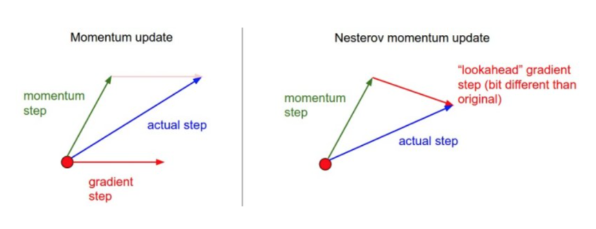

# Chapter4 

## 参数更新
**随机梯度下降及各种更新方法**
**普通更新**：最简单的更新形式是沿着负梯度方向改变参(因为梯度指向的是上升方向，我们童话参观希望最小化损失函数)
```python
x += -learning_rate * dx
```

**动量更新**：损失值可以理解为是山的高度(因此高度势能是 U=mgh),用随机数值初始化参数等同于在某个位置给质点设定初始速度为0，这样最优化过程可以看作是 模拟参数向量(即质点)在地形上滚动的过程。

因为作用于质点的力和梯度的潜在能量有关，质点所受的力就是损失函数的 **负梯度**。因为 F=ma, 所以在这个观点下(负)梯度与质点的加速度是成比例的。
```python
# 动量更新
v = mu * v - learning_rate * dx # 与速度融合
x += v # 与位置融合
```
在这里引入了一个初始化为0的变量v和一个超参数mu。说得不恰当一点，这个变量（mu）在最优化的过程中被看做动量（一般值设为0.9），但其物理意义与摩擦系数更一致。这个变量有效地抑制了速度，降低了系统的动能，不然质点在山底永远不会停下来。通过交叉验证，这个参数通常设为[0.5,0.9,0.95,0.99]中的一个。和学习率随着时间退火（下文有讨论）类似，动量随时间变化的设置有时能略微改善最优化的效果，其中动量在学习过程的后阶段会上升。一个典型的设置是刚开始将动量设为0.5而在后面的多个周期（epoch）中慢慢提升到0.99。

>通过动量更新，参数向量会在任何有持续梯度的方向上增加速度
Nesterov动量与普通动量有些许不同，最近变得比较流行。在理论上对于凸函数它能得到更好的收敛，在实践中也确实比标准动量表现更好一些。

Nesterov动量的核心思路是，当参数向量位于某个位置x时，观察上面的动量更新公式可以发现，动量部分（忽视带梯度的第二个部分）会通过mu * v稍微改变参数向量。因此，如果要计算梯度，那么可以将未来的近似位置x + mu * v看做是“向前看”，这个点在我们一会儿要停止的位置附近。因此，计算x + mu * v的梯度而不是“旧”位置x的梯度就有意义了。

Nesterov动量。既然我们知道动量将会把我们带到绿色箭头指向的点，我们就不要在原点（红色点）那里计算梯度了。使用Nesterov动量，我们就在这个“向前看”的地方计算梯度。
```python
# 动量更新
x_ahead = x + mu * v
# 计算dx_ahead(在x_ahead处的梯度，而不是在x处的梯度)
v = mu * v - learning_rate * dx_ahead
x += v
```
然而在实践中，人们更喜欢和普通SGD或上面的动量方法一样简单的表达式。通过对x_ahead = x + mu * v使用变量变换进行改写是可以做到的，然后用x_ahead而不是x来表示上面的更新。也就是说，实际存储的参数向量总是向前一步的那个版本。x_ahead的公式（将其重新命名为x）就变成了：

```python
v_prev = v # 存储备份
v = mu * v - learning_rate * dx # 速度更新保持不变
x += -mu * v_prev + (1 + mu) * v # 位置更新变了形式
```